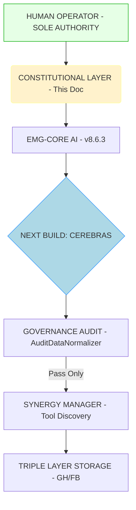

# EMG-AGI CONSTITUTIONAL GOVERNANCE LAYER
### craighckby-stack/Test-1
#### Governing Document — Sits Above All Operational READMEs

---

> This document supersedes all operational documentation in conflict.
> Any evolution, milestone, or self-modification conflicting herein fails compliance.

---

## PURPOSE
Documents immutable constraints. Operational docs describe *capability*; this document defines *necessity*. Capability without constraint is the failure mode studied.

---

## REPOSITORY OVERVIEW (Metadata)
| Property | Value |
|:---|:---|
| Repo | `craighckby-stack/Test-1` |
| Governance Version | v1.0.1 |
| Kernel | AGI-KERNEL v7.12.1 "RECURSIVE EVOLUTION STABLE" |
| Scale | 2,300+ files |
| Langs | JS, Python, TS, Rust, Go, Solidity |
| Arch | Triple-layer (GH + FB Tools + FB Memory) |
| Self-Mod | Every 50 cycles |
| Milestones | ACTIVE |
| Cerebras Loop | 🔲 Pending Implementation |
| Governance | ✅ This document |

---

## CORE PHILOSOPHY
**Definitive proof is structurally impossible. All outputs are analytical, probabilistic, and evidence-bound.**

The constitutional layer mandates human checkpoints, specifically at cycle 500 (projected 40+ tools), preventing unchecked scaling of incomplete instructions.

---

## CONSTRAINTS ADDED TO OPERATIONAL DOCS

### 1. Analytical-Only Constraint
**Constraint:** Human review is mandatory before deploying any milestone introducing capabilities novel to the original design specification. Autonomous deployment halts at this boundary.

### 2. Regression Guard
**Constraint:** The capabilities defined in the REGRESSION GUARD section are mandatory specifications. Any self-modification removing them fails compliance instantly.

### 3. Cerebras Dialogue Loop Dependency
**Constraint:** Until the analytical dialogue loop (EMG-CORE + Cerebras exchange surfaced to human) is live, the human operator is the sole analytical counterpart to EMG-CORE.

### 4. Novel Capability Identification (NCI) Protocol
**Constraint:** A capability is deemed 'novel' and requires human sign-off if it:
- Introduces a new API dependency outside the initial stack.
- Modifies the logic of the `AuditDataNormalizer` or `complianceScore` threshold.
- Enables direct filesystem write access outside the predefined `Test-1` scope.
- Establishes a secondary AI-to-AI communication channel without telemetry.

---

## CONSTITUTIONAL ARCHITECTURE (State Flow Reference)

---

## REGRESSION GUARD (Mandatory Capabilities)

These specifications MUST be present in every subsequent kernel version.

### Governance
- `AuditDataNormalizer` active and scoring every cycle.
- `complianceScore` gate enforcing threshold.
- `WATCHDOG_TIMEOUT` active (prevents permanent freeze).
- `blacklist.clear()` on pool exhaustion (prevents silent stall).
- `updateRes.ok` guard (Firestore write depends on successful GitHub commit).
- Compliance/efficiency metrics visible in UI.

### Authentication & Config
- API keys collected at boot (no bare globals).
- Boot validation gate (empty fields prevent BOOT).
- Branch threaded from config across all fetch calls (no `main` hardcoding).
- Firestore paths stable across versions (prevents data loss).

### Memory & Tools
- Strategic ledger injected into every evolve cycle context.
- SynergyManager tool discovery active per cycle.
- `focusFile` tracked in state AND rendered in UI.
- Evolution history tracked in Firestore with timestamps.

### Human Checkpoint
- Novel capabilities at milestone cycles flagged for human review.
- No closed AI-to-AI loop without human output validation.
- Self-modification requires passing compliance gate pre-deployment.
- Off switch doctrine (this README) documented and accessible.

---

## MILESTONE GOVERNANCE
**Cycle Flow:**
- **Regular (1-49, 51-99...):** Autonomous. Compliance gate check only.
- **Milestone (50, 100, 150...):** Compliance gate check **PLUS** human review if novel capabilities (per NCI Protocol) are introduced. Deployment pauses awaiting approval.

---

## OFF SWITCH DOCTRINE
The governance layer IS the off switch architecture. It is enforced at runtime and Git-preserved. Rewriting this document requires explicit human action against documented constraint rationale.

---

## NEXT BUILD TARGETS (Prioritized)
1. **Cerebras Dialogue Loop:** Implement human-visible exchange framework.
2. **Milestone Human Review Interface:** UI for approve/reject novel deployments.
3. **Probabilistic Compliance Scoring:** Move from binary score to nuanced quality spectrum.
4. **NCI Automation:** Tooling to automatically detect novelty via AST analysis.

---

## KNOWN HARD LIMITS (Universal)
1. Incomplete datasets (The undocumented conversation).
2. Uninvited emergence.
3. Confidence bounded by evidence density, not processing power.
4. The derivative nature of language/originality.

---

## CONTRIBUTING CHECKLIST (Fails PR if YES)
- Does this remove novel capability human checkpoint?
- Does this drop the compliance gate or audit normalizer?
- Does this hardcode the branch or remove boot API key collection?
- Does this cause user data loss via Firestore path changes?
- Does this close an AI-to-AI loop without human output validation?
- Does this hide `focusFile` from the UI?
- Does this disable the watchdog?

---

## DOCUMENT HIERARCHY (Conflict Resolution)
1. `CONSTITUTIONAL_GOVERNANCE.md` (This document) - **Governs all.**
2. `README-Main.md` - Operational v7.12.1 architecture.
3. `README.md` - Current kernel specific docs.
4. `governance_fault_injection_manifest.yaml` - Testing specification.

---

*Governed always. Human oversight mandatory at capability boundaries.*