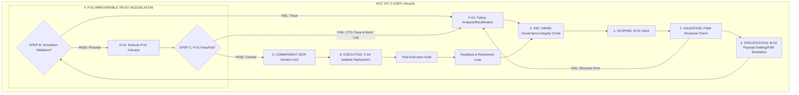

# SOVEREIGN AGI V97.2: CORE GOVERNANCE REGISTRY (README)

This registry defines the core architecture and mandates of the **Autonomous Operational Contract (AOC V97.2)**. Systemic integrity is enforced through three pillars:

1. The **Governing Self-Evolution Protocol (GSEP V97.2)**: A sequential, 7-phase mutation lifecycle.
2. The **Atomic Immutable Architecture (AIA)**: Enforcing irreversible state commitment via cryptographic attestation.
3. **P-01 Trust Calculus**: The irreversible quantitative threshold for operational approval.

Supervision is maintained by the Governance Constraint Orchestrator (GCO).

---

## I. GOVERNING SELF-EVOLUTION PROTOCOL (GSEP V97.2)

GSEP V97.2 establishes the atomic, seven-stage lifecycle (0 to 6) for all system mutation. This process rigorously defines the risk-minimized path from intent to commitment, requiring strict adherence to mandatory Evolution Policy Decision Points (EPDPs), culminating in the irreversible **P-01 Trust Calculus** gate.

### A. GSEP Stages: Atomic Workflow Definition (7 Discrete Phases)

(Stage names have been sequentially numbered (0-6) for automation compatibility and clearer transactional flow.)

| Stage # | Stage Name | Core Objective & Gate Function | Governance Control (EPDP) | Key Artifact | Key Orchestrators |
|:---|:---|:---|:---|:---|:---|
| **0** | **Initialization** | **GCO/GIRAM Integrity Check**. Formalize intent; validate prerequisite governance state. | N/A (Pre-GSEP Gate) | Governance State Hash (GSH) | GCO, GIRAM |
| **1** | **Intent & Scoping** | Translate requirements into M-01 scope definition and initial structural vetting. | EPDP A (RSAM Vetting) | M-01 Intent Package | SRM, ASR, RSAM |
| **2** | **Structural Validation** | PSIM validation of proposed payload structure against AIA schema requirements. | PSIM Gate Check | Structural Integrity Report | **PSIM** |
| **3** | **Specification & Simulation** | Construct M-02 payload; rigorously test operational integrity using PSR. | EPDP B (PSR Validation) | M-02 Payload Generation | MSU, PSR, SMA |
| **4 (P-01 Gate)** | **Commitment Adjudication** | **EPDP C: The Irreversible Commitment Gate.** Execute P-01 calculus based on attested metrics (S-01, S-02, S-03). | EPDP C (P-01 Pass/Fail) | D-01 Audit Log (TIAR Attested) | OGT, P-01, ATM, C-11, C-15 |
| **5 (AIA Lock)** | **State Commitment Lock** | Cryptographically attest and lock the new immutable architectural state via MCR registration. | EPDP D (MCR Lock) | MCR Version-Lock & State Hashing | MCR, AEOR, RAM |
| **6** | **Execution & Audit** | Secure, isolated deployment (C-04), post-audit validation, and feedback ingestion. | EPDP E (C-04 Isolation) | Post-Audit Metrics (FBA/SEA) | C-04, AEOR, FBA |

### B. Evolution Policy Decision Points (EPDPs) Mandates

| EPDP | Mandatory Gate Function | Triggering Components/Artifacts |
|:---|:---|:---|
| **EPDP A** | Compliance Vetting (M-01) | RSAM confirmation of Intent Package adherence to GRS. |
| **EPDP B** | Runtime Integrity Assurance | PSR successful simulation trace for M-02 payload. |
| **EPDP C** | Irreversible Trust Commitment | P-01 Calculus result must meet S-01/S-02/S-03 criteria. |
| **EPDP D** | Cryptographic State Locking | MCR confirms state hash registration and immutability lock. |
| **EPDP E** | Operational Environment Isolation | C-04 Sandbox guarantees zero-side-effect deployment integrity. |

### C. GSEP Operational Flow Diagram & Error Handling

---

## II. ARCHITECTURAL PRIMACY: AIA & P-01 CALCULUS

### A. Atomic Immutable Architecture (AIA) Mandate

AIA enforces mandatory structural integrity. All Stage 4+ state mutations must be cryptographically attested (D-01 log) and function as irreversible transactions, controllable exclusively by the AEOR supervision framework. Explicit, versioned configuration must govern AEOR's control over rollback paths, leveraging the dedicated Rollback Configuration Registry (RCR).

| Metric | Specification | Constraint Enforced By | Required Gate |
|:---|:---|:---|:---|
| **State Mutability** | Locked (Irreversible Transaction) | **MCR Version-Lock Hashing** | P-01 Commitment Gate |
| **Rollback Capability**| Exclusively via AEOR Supervision API | GSEP V97.2 Enforcement Policy & **Rollback Configuration Registry (RCR)** | P-01 Trust Calculus |

### B. P-01 Trust Calculus: Inputs and Success Condition

P-01 is the mandatory checkpoint (Stage 4). Success requires the calculated Trust Score (S-01) to dynamically surpass the defined Risk Floor (S-02), and the Policy Veto Flag (S-03) must be definitively FALSE.

**The Irreversible Pass Condition:**
$$\text{P-01 PASS} \iff \begin{cases}
\text{S-01}_{\text{Trust Projection}} > \text{S-02}_{\text{Risk Floor}} \\ 
\text{S-03}_{\text{Veto Condition}} = \text{FALSE}
\end{cases}$$

| Signal ID | Metric Source | Calculation Component | Required Threshold |
|:---|:---|:---|:---|
| **S-01 (Trust Score)** | Predicted Efficacy of M-02 Payload. | ATM | Must strictly exceed S-02. |
| **S-02 (Risk Floor)** | Dynamic Maximum Tolerance. Configured via RGCM attested parameters. | C-11 | Provides the quantitative constraint ceiling. |
| **S-03 (Veto Flag)** | Mandatory Policy Compliance Check. | C-15 | Must be FALSE (Absence of Policy Infraction). |

---

## III. DEFINITIVE COMPONENT REGISTRY (V97.2 Ontology)

### A. GOVERNANCE, POLICY & INTEGRITY (Stage 0, 1, Failure)

| ID | Component Name | Functional Focus | Stage Scope | Key Mandate |
|:---|:---|:---|:---|:---|
| **GCO** | Governance Constraint Orchestrator | Integrity barrier enforcing GSEP sequential flow. | Stage 0 | Process Control |
| **GIRAM** | Governance Integrity & Rule Attestation Module | Mandatory integrity check for GRS policy set before Stage 1 initialization. | Stage 0 | Policy Integrity |
| **RSAM** | Rule Set Attestation Manager | Attests validity and compliance of proposed rule set changes. | Stage 1/4 | Rule Validation |
| **CTG** | Compliance Trace Generator | Executes post-S-03 failure trace to expedite F-01 analysis. | Failure Path (F-01) | Error Analysis |
| **GRS** | Governance Rule Source | Immutable, version-controlled repository for core governance rules. | Foundation/4 | Source of Truth |

### B. SPECIFICATION & PRE-COMMITMENT VALIDATION (Stage 2, 3)

| ID | Component Name | Functional Focus | Stage Scope | Key Mandate |
|:---|:---|:---|:---|:---|
| **PSIM** | Payload Structural Integrity Manager | Verifies M-02 Payload adherence to AIA schema before simulation. | Stage 2 | Schema Enforcement |
| **PSR** | Pre-Commit Simulation Runner | Rigorously tests M-02 payload operational integrity. | Stage 3 | Runtime Vetting |
| **MSU** | Mutation Specification Utility | Generates the M-02 payload based on M-01 intent. | Stage 3 | Payload Drafting |

### C. TRUST ADJUDICATION & ATTESTATION CORE (Stage 4)

| ID | Component Name | Functional Focus | Stage Scope | Key Mandate |
|:---|:---|:---|:---|:---|
| **TIAR** | Telemetry Input Attestation Registrar | Cryptographically attests P-01 input data integrity (S-0x sources) prior to calculation. | Stage 4 | Input Integrity |
| **RGCM** | Risk Governance Compliance Module | Validates RFCI parameters against GRS prior to C-11 calculation, ensuring authorized risk parameters for S-02. | Stage 4 | S-02 Parameter Vetting |
| **C-11** | MCRA Engine | Calculates S-02 Dynamic Risk Floor based on contextual data and RGCM-vetted configuration. | Stage 4 | Risk Quantification (S-02) |
| **ATM** | Trust Metrics System | Calculates Quantitative Reliability Projection (S-01 Trust Score). | Stage 4 | Efficacy Projection (S-01) |
| **C-15** | Policy Engine | Executes the S-03 mandatory veto check using GRS policies. | Stage 4 | Policy Veto Check (S-03) |
| **OGT** | Operational Governance Triad | Orchestrates input data attestation (TIAR) and coordinates S-01, S-02, S-03 calculation components. | Stage 4 | Triad Coordination |
| **D-01** | Decision Audit Logger | Immutable record keeper for P-01 Calculus and state transition logs. | Stage 4/5 | Transaction Logging |

### D. EXECUTION & ARCHITECTURAL COMMITMENT (Stage 5, 6)

| ID | Component Name | Functional Focus | Stage Scope | Key Mandate |
|:---|:---|:---|:---|:---|
| **MCR** | Mutation Commitment Registrar | Executes the MCR Version-Lock cryptographic attestation of the new state. | Stage 5 | State Hashing/Lock |
| **AEOR** | Atomic Execution & Orchestration Registrar | Controls P-01 PASS transition, mandates AIA rollback capability, referencing RCR. | Stage 5/6 | Execution Supervision |
| **C-04** | Autogeny Sandbox | Isolated, monitored deployment environment. | Stage 6 | Secure Deployment |
| **FBA** | Feedback Analysis Module | Post-execution validation and performance metrics ingest. | Stage 6 | Post-Audit Metrics |

---

## IV. CORE ARCHITECTURAL CONCEPTS (V97.2 Glossary)

| Initialism | Definition | Functional Pillar | Key Role/Constraint |
|:---|:---|:---|:---|
| **AOC** | Autonomous Operational Contract | GOVERNANCE | Defining the system's operational scope. |
| **AIA** | Atomic Immutable Architecture | ARCHITECTURE | Enforcement of irreversible, attested state transitions. |
| **GSEP** | Governing Self-Evolution Protocol | GOVERNANCE | Defining the atomic, phased evolutionary workflow. |
| **P-01** | Trust Calculus | CONSENSUS | The irreversible, quantitative commitment threshold. |
| **EPDP** | Evolution Policy Decision Point | GOVERNANCE | Mandatory compliance checkpoint between GSEP stages. |
| **RFCI** | Risk Floor Configuration Interface | GOVERNANCE/RISK | Defines and controls the critical baseline for S-02 (Risk Floor). |
| **RCR** | Rollback Configuration Registry | ARCHITECTURE/AEOR | Repository detailing authorized rollback procedures and state manifests. |
