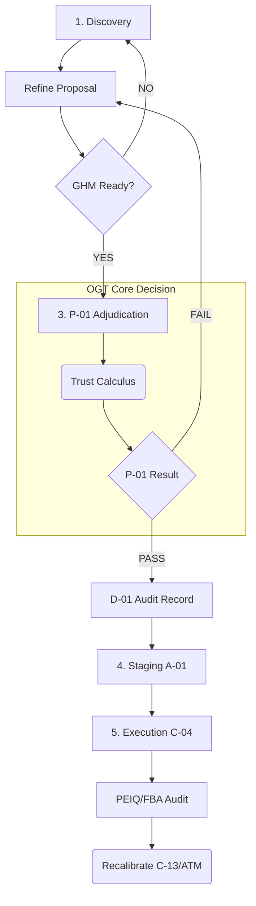

# 👑 Sovereign AGI v99.0: Governed Self-Evolution Architecture (GSEA)

## 💡 Strategic Mandate: High-Integrity, Auditable, Risk-Managed Mutation

The **Governed Self-Evolution Architecture (GSEA)** enforces a non-negotiable, policy-driven lifecycle. System mutations must achieve auditable, maximum confidence, dictated by the foundational **P-01 Adjudication Constraint** and overseen by the **Operational Governance Triad (OGT)**, with absolute policy conformity guaranteed by the **Compliance and Policy Enforcement Layer (CPEL)**.

---

## 1.0 FOUNDATIONAL GOVERNANCE: P-01 TRUST CALCULUS

System evolution is fundamentally governed by the **Architectural Integrity Constraint (P-01)**. This constraint mandates execution only upon achieving quantitative maximum trust, calculated across three independent, critical input streams forming the Core Governance Triad.

### P-01: Trust Calculus Mandatory Constraints

| Input Stream | Component ID | Description | Adjudication Requirement | Layer Enforcement |
|---|---|---|---|---|
| **Payload Reliability Score** | ATM (C-12) | Quantitative calculation of payload's predicted success and reliability impact. | `Actual_Weighted_Score` | OGT Core |
| **Required Confidence Threshold** | MCRA Engine (C-11) | Minimum acceptable risk tolerance derived from contextual failure forecasting. | `Required_Confidence_Threshold` | OGT Core |
| **Governance Veto Signal** | Policy Engine (C-15/E-01) | Immediate veto based on internal policy (C-15) or mandatory external mandates (E-01). | Must be Veto=`FALSE` | CPEL/OGT |

**Decision Rule (P-01):** PASS if (`Actual_Weighted_Score` > `Required_Confidence_Threshold`) AND (`Veto Signal` == FALSE).
*P-01 success mandates an immutably signed record via D-01 Audit Logger.*

---

## 2.0 GOVERNED SELF-EVOLUTION PROTOCOL (GSEP)

GSEP defines the mandatory, risk-optimized, five-stage lifecycle workflow, ensuring sequential, auditable adherence to OGT and CPEL mandates.

### 2.1 GSEP Stages & Policy Gates

| Stage # | Stage Name | Primary Components | Mandatory Gate & Check |
|---|---|---|---|
| **1. Intent Discovery** | Goal Definition | C-13, C-14 | **CPEL Gate:** Strategic Scope Definition and C-13 alignment. |
| **2. Proposal Generation** | Mutation Draft | GHM, C-15 | **OGT Prerequisite:** GHM Operational Readiness Signal. |
| **3. Adjudication & Commitment** | OGT Core (P-01) | **OGT Gate:** P-01 Consensus Approval (Trust Calculus check). |
| **4. Architectural Staging** | Integrity Lock (A-01) | **Integrity Lock Envelope:** Signed payload version locking. |
| **5. Execution & Feedback**| Deployment (C-04) | **Post-Execution Audit:** PEIQ Quarantine Trigger/FBA Metric Aggregation. |

### 2.2 GSEP Flow Visualization (P-01 Centrality)

---

## 3.0 ARCHITECTURAL REGISTER: FUNCTIONAL PLANES

### 3.1 Plane A: Policy & Trust Calculus (OGT Core)

These modules define, enforce, and log mandatory P-01 adherence checks, ensuring policy integrity.

| ID | Component | Summary | Layer Role | Critical Output | Location |
|---|---|---|---|---|---|
| **C-11** | MCRA Engine | Failure Forecasting and Contextual Risk Modeling. | P-01 Input Source | Required Threshold. | `src/consensus/mcraEngine.js` |
| **ATM** | Trust Metrics | Quantitative calculation of payload reliability and risk profile. | P-01 Input Source | Actual Score. | `src/consensus/atmSystem.js` |
| **C-15** | Policy Engine | Internal Constraint Handler and Core Governance Rule loader. | CPEL Enforcement | Global Veto Signal. | `src/core/policyEngine.js` |
| **E-01** | External Policy Index | Read-only cache for immutable external mandates (e.g., kill-switches). | External Veto Modifier | Mandatory Compliance Veto. | `src/governance/externalPolicyIndex.js` |
| **GHM** | Gov. Health Monitor | Preemptive verification of OGT component operational readiness state. | OGT Prerequisite | Readiness Signal (GRS). | `src/governance/healthMonitor.js` |
| **CIM** | Config Integrity Monitor (NEW) | Securely locks and validates integrity of critical governance files (e.g., C-15 policy config). | Policy Protection Layer | Integrity State. | `src/governance/configIntegrityMonitor.js` |

### 3.2 Plane B: Execution & Lifecycle Management

These modules manage the workflow stages, proposal preparation, and environment execution.

| ID | Component | Summary | GSEP Role | Location |
|---|---|---|---|---|
| **C-13** | Strategic Intent Cache (SIC) | Defines long-term goals and permissible scope boundaries for evolution. | Goal Filtering (Stage 1) | `src/memory/strategicCache.js` |
| **C-14** | Goal Discovery Agent (CGD) | Negotiates and translates C-13 intent into structured, deployable technical tasks. | Cycle Initiation (Stage 1) | `src/agents/goalDiscovery.js` |
| **A-01** | Arch. Proposal Mgr. | Secures, version-locks, and stages accepted P-01-approved mutation payloads. | Pre-Execution Lock (Stage 4) | `src/core/archProposalManager.js` |
| **C-04** | Autogeny Sandbox | Isolated, ephemeral execution environment supporting atomic deployment/rollback. | Mutation Execution (Stage 5) | `src/execution/autogenySandbox.js` |

### 3.3 Plane C: Auditing, Integrity & Feedback Loop

These modules handle integrity verification, compliance logging, and metric processing.

| ID | Component | Summary | GSEP Role | Location |
|---|---|---|---|---|
| **D-01** | Audit Logger | Immutable, cryptographically signed record keeper for all P-01 consensus outcomes. | Compliance Trace | `src/core/decisionAuditLogger.js` |
| **PEIQ** | Integrity Quarantine | Monitors post-execution integrity; isolates and flags failure vectors based on runtime invariants. | Post-Execution Audit | `src/governance/integrityQuarantine.js` |
| **FBA** | Feedback Aggregator | Handles post-execution metric ingestion and triggers recalibration signals for C-13/ATM tuning. | Post-Execution Update | `src/core/feedbackLoopAggregator.js` |